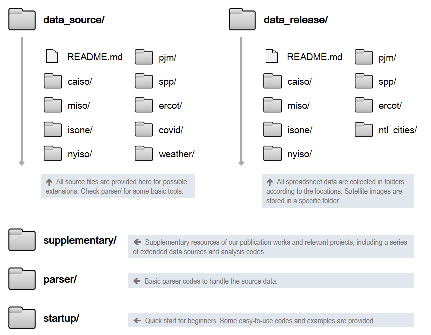

# A Cross-Domain Data Hub to Track the Impact of COVID-19 on U.S. Electricity Markets

 &nbsp;

> This data hub, **COVID-EMDA+** (**C**oronavirus **D**isease - **E**lectricity **M**arket **D**ata **A**ggregation+), is specifically designed to track the potential impacts of COVID-19 on the existing U.S. electricity markets. Many different data sources are merged and harmonized here in order to enable further interdisciplinary researches.

## Features
- Overall, this data hub contains the `coronavirus case & deaths`, `weather`, `generation mix`, `load` and `price data` for all the existing U.S. electricity marketplaces (CAISO, MISO, ISO-NE, NYISO, PJM, SPP , ERCOT) and some typical cities in these markets (Los Angeles, Boston, New York City, Philadelphia, Chicago, Kansas City, Houston). We also integrate other additional resources, including the `mobile device location`, `night-time lighting images`, `load forecasting`, `congestion price`, `forced outage` and `renewable curtailment data`. Historical data dating back to 2017 are included as time-series benchmarks.
- This data hub is updated every day after careful quality control. All data are carefully verified and coordinated to match the geological scale. All data are recorded and tidied in a consistent, compact and ready-to-use data format that makes it easy for cross-market analysis.
- Some useful parsers as well as supplementary resources are provided for other user-defined extensions.

## Navigation
This data hub mainly contains five components: source data, released data, supplementary resources, parser codes, and  quick start tutorials. We navigate this data hub as follows.

All the data source files are archived in folder `date_source/`, the cleaned and processed data are stored in folder `data_release/`. The support team will conduct daily updates to capture the latest data. All these files are properly collected by location. The file naming convetion for this data hub is: `MARKET_AREA_CATEGORY.csv`, e.g. `nyiso_nyc_load.csv` is a dataset of load profile in New York City from 2017 to present.

Readers can turn to folder `startup/` for quick start, `supplementary/` for addtional data and codes in our research work, and `parser/` for the basic tools to handle the source files.

## Suggested Citation 
- Please cite the following paper when you use this data hub:  
`
G. Ruan, D. Wu, X. Zheng, H. Zhong, C. Kang, M. A. Dahleh, S. Sivaranjani, and L. Xie, ``A Cross-Domain Approach to Analyzing the Short-Run Impact of COVID-19 on the U.S. Electricity Sector,'' Joule, 2020. (Accepted)
`\
This paper conducts a comprehensive introduction of this data hub and further analysis results for electricity demand across the U.S.\
Available at: [arXiv](https://arxiv.org/abs/2005.06631) and [EnerarXiv](http://www.enerarxiv.org/page/thesis.html?id=1840).
- Other research studies of our group are recommended:   
`
G. Ruan, J. Wu, H. Zhong, Q. Xia, and L. Xie, ``Quantitative Assessment of U.S. Bulk Power Systems and Market Operations during the COVID-19 Pandemic,'' 2020. (Submitted to Applied Energy)
`\
This paper substantiates the pandemic's impacts from the perspectives of power system security, electric power generation, electric power demand and electricity prices.\
Available at: [EnerarXiv](http://www.enerarxiv.org/page/thesis.html?id=2196).\
`
H. Zhong, Z. Tan, Y. He, L. Xie, and C. Kang, ``Implications of COVID-19 for the Electricity Industry: A Comprehensive Review'', CSEE Journal of Power and Energy Systems, 2020.
`\
This paper provides a review of the global impacts that COVID-19 has caused on the electricity sector.\
Available at: [JPES](https://ieeexplore.ieee.org/abstract/document/9160443).

## Data Source
This data hub contains five major components: U.S. electricity market data, public health data, weather data, mobile device location data, and satellite images. For some categories, multiple data sources are carefully gathered to ensure accuracy.

- **Electricity Market Data**:\
**Description**: &nbsp; This part includes the generation mix, metered load profiles and day-ahead locational marginal prices data. We also include the day-ahead load forecasting, congestion price, forced outage and renewable curtailment data as the supplementary source.\
**Link**: &nbsp; [CAISO](http://oasis.caiso.com/mrioasis/logon.do), &nbsp; [MISO](https://www.misoenergy.org/markets-and-operations/real-time--market-data/market-reports/), &nbsp; [ISO-NE](https://www.iso-ne.com/markets-operations/iso-express), &nbsp; [NYISO](https://www.nyiso.com/energy-market-operational-data), &nbsp; [PJM](https://dataminer2.pjm.com/list), &nbsp; [SPP](https://marketplace.spp.org/groups/operational_data), &nbsp; [ERCOT](http://www.ercot.com/), &nbsp; [EIA](https://www.eia.gov/beta/electricity/gridmonitor/dashboard/electric_overview/US48/US48), &nbsp; [EnergyOnline](http://www.energyonline.com/).

- **Public Health Data**:\
**Description**: &nbsp; This part includes the COVID-19 confirmed cases, deaths data, infection rate and fatal rate. We aggregate and fine-tune the data to market and city levels.\
**Link**: &nbsp; [John Hopkins CSSE](https://github.com/CSSEGISandData/COVID-19).

- **Weather Data**:\
**Description**: &nbsp; This part includes temperature, relative humidity, wind speed and dew point data. Typical weather stations are selected according to their geological locations and data quality.\
**Link**: &nbsp; [Iowa State Univ IEM](https://mesonet.agron.iastate.edu/request/download.phtml), &nbsp; [NOAA](https://www.nws.noaa.gov/ost/asostech.html).

- **Mobile Device Location Data**:\
**Description**: &nbsp; This part includes social distancing data and patterns of visits to Point of Interests (POIs). These data are derived by aggregating and processing the real-time GPS location of cellphone users by Census Block Group. To obtain the access to the original data, please click the link below and apply for SafeGraph's permission (totally free).\
**Link**: &nbsp; [Mobility Data from SafeGraph](https://docs.safegraph.com/docs)

- **Night Time Light (NTL) Satellite Data**:\
**Description**: &nbsp; This part includes the raw satellite image taken at night time in each area.\
**Link**: &nbsp; [NTL Images from NASA](https://ladsweb.modaps.eosdis.nasa.gov/missions-and-measurements/products/VNP46A1/)

## Support Team
This project is a collaboration of our group members under the supervision of Prof. Le Xie at Texas A&M University. The support team keeps processing, correcting and updating the data every day. The team will also conduct further research analysis and share the latest progress in this repository.

Please also check our [Group Website](https://gridx.engr.tamu.edu/?page_id=30) for the detailed biography of each group member.

## Contact Us
Please contact us if you need further technical support or search for cooperation. Pull requests are welcome. For major changes, please open an issue first to discuss what you would like to change.\
Email contact: &nbsp; [Le Xie](mailto:le.xie@tamu.edu?subject=[GitHub]%20COVID-EMDA), &nbsp; [Dongqi Wu](mailto:dqwu@tamu.edu?subject=[GitHub]%20COVID-EMDA), &nbsp; [Xiangtian Zheng](mailto:zxt0515@tamu.edu?subject=[GitHub]%20COVID-EMDA), &nbsp; [Jiahan Wu](mailto:jiahwu95@tamu.edu?subject=[GitHub]%20COVID-EMDA).

